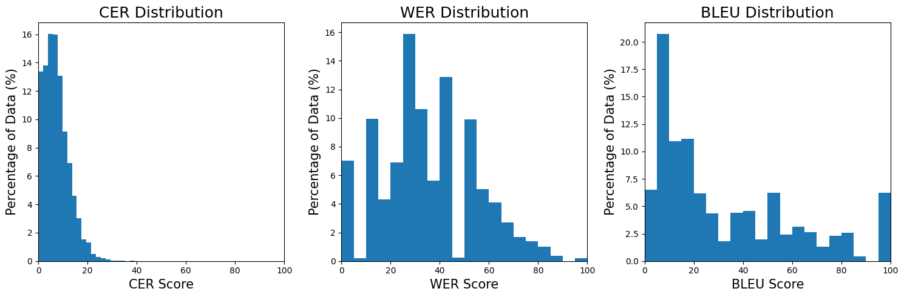
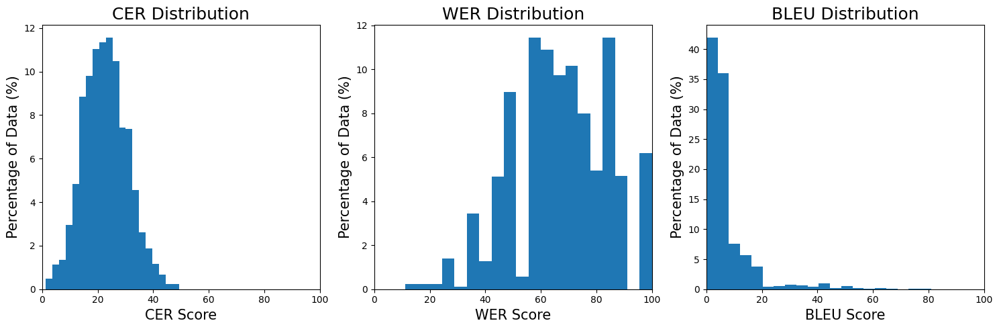

# Romanized to Native Malayalam Script Transliteration

Shared-Task code submitted to [IndoNLP Workshop](https://indonlp-workshop.github.io/IndoNLP-Workshop/) colocated with [COLING 2025](https://coling2025.org/), in Abu Dhabi, UAE.

The training notebook shows the [code](./transliteration-training.ipynb).

## Training

Data derived from:

1. Dakshina
    1. [Romanized](https://huggingface.co/datasets/vrclc/Dakshina-romanized-ml) - 186 thousand  word transliteration pairs
    2. [Lexicons](https://huggingface.co/datasets/vrclc/dakshina-lexicons-ml) - 58.4 thousand lexicon entries
2. [Aksharantar](https://huggingface.co/datasets/vrclc/Aksharantar-ml) - 4.3 million word transliteration pairs

## RESULT

We present the evaluation scores averaged over the two test datsets shared by the task organizers.

The detailed report on the transliteration output on the test datsets can be viewd at [VRCLC Huggingface Datasets](https://huggingface.co/datasets/vrclc/IndoNLP-Transliteration-ml).

| **Dataset**   | **CER (%)** | **WER (%)** | **BLEU (%)** |
|---------------|-------------|-------------|--------------|
| Test Set-1    | 7.4         | 34.5        | 32.7         |
| Test Set-2    | 22.7        | 66.9        | 7.5          |

### Test Set-1

### Test Set-2

